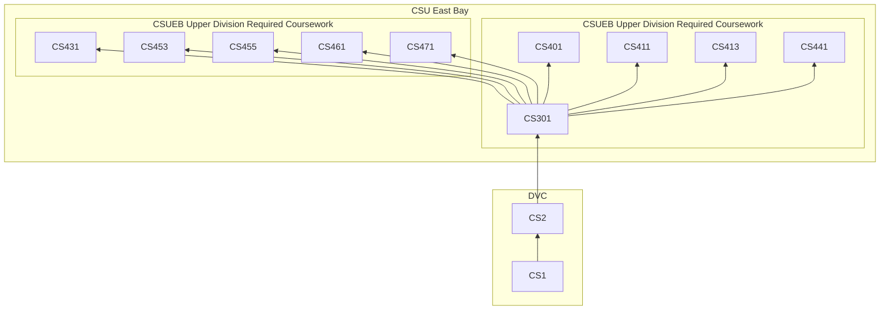

```mermaid
%%{init: {'theme': 'default', "flowchart" : { "curve" : "stepDown" } } }%%
flowchart BT
    subgraph DVC
        CS1  --> CS2
    end
    
    subgraph CSUEB ["CSU East Bay"]
       
        CS2 --> CS301
       
        subgraph UD ["CSUEB Upper Division Required Coursework"]
            CS301 --> CS401
            CS301 --> CS411
            CS301 --> CS413
            CS301 --> CS441
        end
       
        subgraph UDB ["CSUEB Upper Division Required Coursework"]
            CS301 --> CS431
            CS301 --> CS453
            CS301 --> CS455
            CS301 --> CS461
            CS301 --> CS471
        end
        
        
    end
    
```